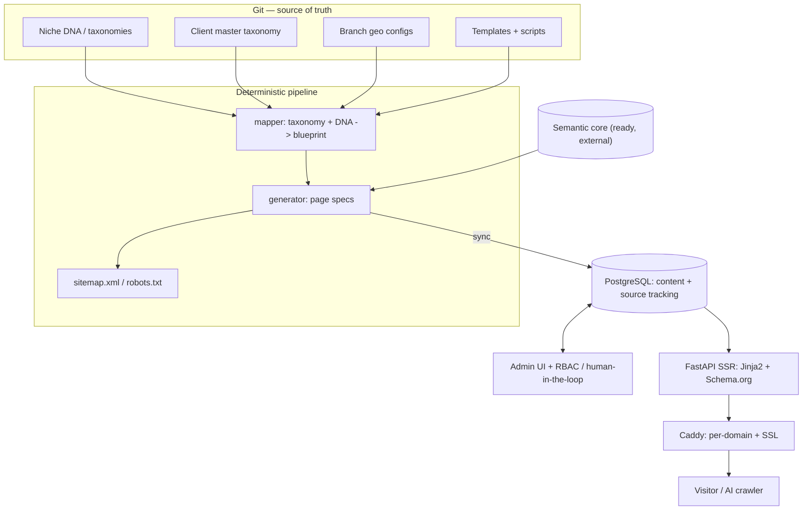

[Русский](./README.ru.md) · **English**

# Site Generator

A self-hosted platform that generates and runs multi-page websites for
local-services businesses at scale. One operator stands up, fills, and
operates dozens of geo-targeted sites from a single deployment — each
optimized for both classic search engines (Yandex, Google, Bing) and AI
answer engines (GEO — generative engine optimization).

> **Disclaimer.** This is a public architectural description of a real
> system the author built. Specific clients, brands, domain names,
> addresses, financial indicators, source code, and proprietary
> implementation details are not disclosed. The content is limited to
> architectural decisions and principles.

## What the system does

From a business's structured inputs (service catalog, locations, niche)
it produces a complete, SEO-ready website per location:

- **Semantic core** — search-demand data (queries, volumes, LSI) per
  niche and geo, consumed as a ready-made core (see "Decoupled semantic
  source" below).
- **Page-spec generation** — a deterministic pipeline turns taxonomy +
  geo config into per-page specs (H1, Title, Description, LSI, block
  structure).
- **Content store** — pages, blocks, and services live in a database
  with **per-field source tracking** (`yaml` / `csv` / `llm` / `manual`
  / `api`), so a re-run never clobbers a human edit.
- **SSR rendering** — server-rendered HTML with Schema.org JSON-LD,
  tuned for AI crawlers (which parse HTML without executing JS) as much
  as for classic crawlers.
- **Admin + human-in-the-loop** — non-technical editors manage content,
  preview, and publish through an admin UI; deploys are pre-validated
  and switched atomically with a health-checked rollback.
- **Multi-tenant operation** — one deployment serves many clients and
  branches, each on its own domain with automatic SSL.

The engine is **niche-agnostic**: a vertical's knowledge lives in
declarative "DNA" modules, and the same pipeline generates sites for
different industries (validated end-to-end against a mock niche).

## The "matryoshka" model

The central idea: separate four nested layers so each piece of work is
reused across many sites.

| Layer | What it is | Reuse |
|---|---|---|
| **DNA** | Universal knowledge of a niche (services, synonyms, intents) | shared across all clients in that vertical |
| **Skeleton** | A client's master taxonomy (their catalog) | per client |
| **Skin** | A branch's geo config (city, district, address, domain) | per location |
| **Brain** | The per-location prompt for AI content generation | per location |

A new location is mostly a new **Skin** over an existing **Skeleton** +
**DNA** — minutes of config, not days of work.

## Business value

Local businesses with several locations need a genuinely local site per
branch to rank in local search — but hand-building and maintaining
dozens of near-identical sites is prohibitively slow, and naive
duplication gets penalized (duplicate H1s, thin pages, copied content).
Meanwhile search is shifting: AI answer engines read pages without
running JavaScript, so JS-heavy site builders lose visibility there.

This platform makes "many local sites" an operating mode rather than a
project: declarative niche knowledge + per-branch geo config compile
into unique, structured, server-rendered pages; per-field source
tracking lets humans refine content without losing it on the next
regeneration; multi-tenancy puts dozens of client domains behind one
deployment with automatic SSL. The result is local-SEO output that
scales with configuration, not headcount, and stays readable by both
classic and AI crawlers.

## My role

A solo project — from idea to working platform:

- **Product** — value proposition, scope, the matryoshka model.
- **Architecture** — git-as-source-of-truth, the DB schema, layer
  boundaries, multi-tenancy strategy.
- **Backend** — the generation pipeline, content store with source
  tracking, admin, SSR renderer, deploy orchestration.
- **Frontend** — server-rendered theme, semantic HTML + Schema.org,
  block system, admin editor.
- **Operations** — Docker deployment, reverse proxy, CI, backups.

## Stack

| Layer | Technologies |
|---|---|
| **Source of truth** | Git + YAML + Markdown (declarations + built-in audit log) |
| **Pipeline** | Python 3.11, idempotent scripts |
| **Backend / API** | FastAPI, async SQLAlchemy 2.x, Alembic, Pydantic v2 |
| **Admin** | SQLAdmin + RBAC (owner / admin / editor / viewer) |
| **Frontend** | Server-side Jinja2 + HTMX, Tailwind, Schema.org JSON-LD |
| **DB** | PostgreSQL 16 (SQLite for dev / test) |
| **Async jobs** | arq + Redis 7 |
| **Reverse proxy** | Caddy (multi-domain, automatic SSL) |
| **Packaging** | Docker + Compose |
| **CI** | GitLab CI (pytest + full pipeline + SEO guards, on SQLite and PostgreSQL) |

## High-level architecture

Full detail — layers, DB schema, data flows, deploy, reliability — in
[`docs/architecture.md`](docs/architecture.md).

## Decoupled semantic source

Semantic harvesting (search-demand collection, dedup, niche taxonomies)
was extracted into a separate platform. This generator became a **pure
consumer** of a ready semantic core through a thin seam
(`SemanticSource`): cache-by-default from a committed cache, HTTP when
the upstream service is available, with fallback to cache. The generator
no longer collects or clusters semantics — it compiles a site from a
finished core. The two concerns evolve independently (the upstream can
grow a multi-niche vector core without touching site generation).

## Key architectural decisions

An ADR-style walkthrough is in [`docs/decisions.md`](docs/decisions.md).
Highlights:

1. **Git as source of truth** — declarations live as files; git log is
   the audit trail; cloning the repo provisions the system.
2. **Deterministic pipeline, LLM only at the edges** — generation is
   reproducible; the LLM touches only content drafting, behind an
   adapter.
3. **Per-field source tracking** — every field records its origin;
   `sync` never overwrites `manual` edits, solving the
   "regeneration destroys human work" problem.
4. **SSR over SPA** — server-rendered HTML is a product requirement for
   GEO: AI crawlers read content without executing JavaScript.
5. **Single-DB multi-tenancy first** — `tenant_id` filtering via
   middleware + ORM events; a client graduates to an isolated instance
   by ETL, without code changes.
6. **Atomic deploy with health-checked rollback** — build to a
   versioned directory, switch by symlink, verify, roll back on failure.
7. **Own FileLock for shared mutable files** — serializes
   load-merge-write on shared semantic banks to prevent lost updates.

## What this project demonstrates

- **A "compiler" mental model for websites**: declarative inputs (DNA ×
  taxonomy × geo × prompt) compile into many unique sites — content as
  build output, not hand-craft.
- **Designing for AI-era search (GEO)**: SSR + Schema.org as a
  first-class requirement, not an afterthought.
- **Human-in-the-loop that survives automation**: source tracking lets
  manual and generated content coexist across regenerations.
- **Multi-tenancy with a clean escalation path**: shared DB now,
  isolated instance later, no rewrite.
- **Solo full-stack ownership**: product, architecture, backend,
  frontend, and operations in one hand.

## Additional documentation

- [`docs/architecture.md`](docs/architecture.md) — layers, data flows,
  DB schema, multi-tenancy, deploy, reliability, testing.
- [`docs/decisions.md`](docs/decisions.md) — ADR-style record of key
  decisions and trade-offs.
