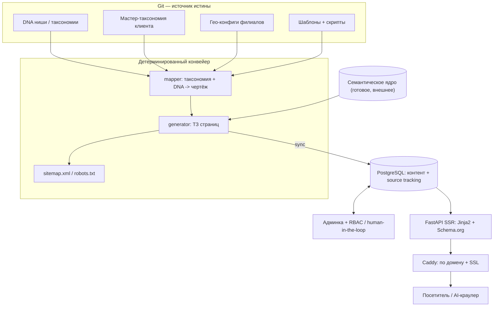

**Русский** · [English](./README.md)

# Site Generator

Self-hosted платформа, которая генерирует и эксплуатирует многостраничные
сайты для локального бизнеса в масштабе. Один оператор поднимает,
наполняет и ведёт десятки гео-таргетированных сайтов из одного
развёртывания — каждый оптимизирован и под классические поисковики
(Yandex, Google, Bing), и под нейросетевые ответные движки
(GEO — generative engine optimization).

> **Дисклеймер.** Это публичное архитектурное описание реальной системы,
> которую построил автор. Конкретные клиенты, бренды, доменные имена,
> адреса, финансовые показатели, исходный код и проприетарные детали
> реализации не раскрываются. Содержание ограничено архитектурными
> решениями и принципами.

## Что делает система

Из структурированных входных данных бизнеса (каталог услуг, локации,
ниша) она производит готовый под SEO сайт на каждую локацию:

- **Семантическое ядро** — данные поискового спроса (запросы, частотность,
  LSI) по нише и гео, потребляются как готовое ядро (см. «Декаплинг
  семантики» ниже).
- **Генерация ТЗ страниц** — детерминированный конвейер превращает
  таксономию + гео-конфиг в постраничные ТЗ (H1, Title, Description, LSI,
  структура блоков).
- **Хранилище контента** — страницы, блоки и услуги лежат в БД с
  **пофайловым source-tracking'ом** (`yaml` / `csv` / `llm` / `manual` /
  `api`), поэтому повторный прогон никогда не затирает ручную правку.
- **SSR-рендеринг** — серверный HTML со Schema.org JSON-LD, заточенный
  под AI-краулеры (которые читают HTML без выполнения JS) не меньше, чем
  под классические.
- **Админка + human-in-the-loop** — нетехнические редакторы ведут
  контент, превью и публикацию через админ-UI; деплой проходит
  предвалидацию и атомарное переключение с откатом по health-check.
- **Мультитенантная эксплуатация** — одно развёртывание обслуживает
  множество клиентов и филиалов, каждый на своём домене с автоматическим
  SSL.

Движок **ниша-агностичен**: знание вертикали лежит в декларативных
модулях «DNA», и тот же конвейер генерирует сайты для разных индустрий
(проверено end-to-end на mock-нише).

## Модель «матрёшки»

Центральная идея — разделить четыре вложенных слоя, чтобы каждая единица
работы переиспользовалась на многих сайтах.

| Слой | Что это | Переиспользование |
|---|---|---|
| **DNA** | Универсальное знание ниши (услуги, синонимы, интенты) | общее для всех клиентов вертикали |
| **Skeleton** | Мастер-таксономия клиента (его каталог) | на клиента |
| **Skin** | Гео-конфиг филиала (город, район, адрес, домен) | на локацию |
| **Brain** | Промпт точки для AI-генерации контента | на локацию |

Новая локация — это в основном новый **Skin** поверх существующих
**Skeleton** + **DNA**: минуты конфига, а не дни работы.

## Бизнес-ценность

Локальному бизнесу с несколькими точками нужен реально локальный сайт на
каждый филиал, чтобы ранжироваться в локальном поиске, — но руками
собирать и поддерживать десятки почти-одинаковых сайтов непомерно долго,
а наивное дублирование штрафуется (дубли H1, тонкие страницы,
скопированный контент). При этом поиск меняется: нейросетевые движки
читают страницы без запуска JavaScript, и JS-тяжёлые конструкторы теряют
там видимость.

Платформа превращает «много локальных сайтов» в режим работы, а не в
проект: декларативное знание ниши + гео-конфиг филиала компилируются в
уникальные, структурированные, серверно-отрендеренные страницы;
пофайловый source-tracking позволяет людям дорабатывать контент, не
теряя его при следующей регенерации; мультитенантность ставит десятки
клиентских доменов за одно развёртывание с автоматическим SSL. Итог —
локальное SEO, которое масштабируется конфигурацией, а не штатом, и
остаётся читаемым и для классических, и для AI-краулеров.

## Моя роль

Сольный проект — от идеи до работающей платформы:

- **Продукт** — ценностное предложение, скоуп, модель «матрёшки».
- **Архитектура** — git как источник истины, схема БД, границы слоёв,
  стратегия мультитенантности.
- **Бэкенд** — конвейер генерации, хранилище контента с source-tracking,
  админка, SSR-рендерер, оркестрация деплоя.
- **Фронтенд** — серверная тема, семантический HTML + Schema.org,
  система блоков, редактор в админке.
- **Эксплуатация** — Docker-развёртывание, reverse proxy, CI, бэкапы.

## Стек

| Слой | Технологии |
|---|---|
| **Источник истины** | Git + YAML + Markdown (декларации + встроенный audit log) |
| **Конвейер** | Python 3.11, идемпотентные скрипты |
| **Бэкенд / API** | FastAPI, async SQLAlchemy 2.x, Alembic, Pydantic v2 |
| **Админка** | SQLAdmin + RBAC (owner / admin / editor / viewer) |
| **Фронтенд** | Серверный Jinja2 + HTMX, Tailwind, Schema.org JSON-LD |
| **БД** | PostgreSQL 16 (SQLite для dev / тестов) |
| **Async-задачи** | arq + Redis 7 |
| **Reverse proxy** | Caddy (мультидомен, автоматический SSL) |
| **Упаковка** | Docker + Compose |
| **CI** | GitLab CI (pytest + полный конвейер + SEO-гарды, на SQLite и PostgreSQL) |

## Архитектура верхнего уровня

Полная детализация — слои, схема БД, потоки данных, деплой, надёжность —
в [`docs/architecture.ru.md`](docs/architecture.ru.md).

## Декаплинг семантики

Сбор семантики (поисковый спрос, дедуп, таксономии ниш) был вынесен в
отдельную платформу. Этот генератор стал **чистым потребителем** готового
семантического ядра через тонкий шов (`SemanticSource`): cache-by-default
из закоммиченного кэша, HTTP когда апстрим-сервис поднят, с фолбэком на
кэш. Генератор больше не собирает и не кластеризует семантику — он
компилирует сайт из готового ядра. Две заботы развиваются независимо
(апстрим может растить мультиниша-векторное ядро, не трогая генерацию
сайтов).

## Ключевые архитектурные решения

ADR-разбор — в [`docs/decisions.ru.md`](docs/decisions.ru.md). Главное:

1. **Git как источник истины** — декларации лежат файлами; git log — это
   audit-трейл; клон репозитория разворачивает систему.
2. **Детерминированный конвейер, LLM только по краям** — генерация
   воспроизводима; LLM трогает только черновики контента, за адаптером.
3. **Пофайловый source-tracking** — каждое поле помнит свой источник;
   `sync` никогда не перезатирает `manual`-правки, решая проблему
   «регенерация уничтожает ручную работу».
4. **SSR вместо SPA** — серверный HTML это продуктовое требование под
   GEO: AI-краулеры читают контент без выполнения JavaScript.
5. **Сначала мультитенантность на одной БД** — фильтрация по `tenant_id`
   через middleware + ORM-события; клиент дорастает до изолированного
   инстанса через ETL, без изменений кода.
6. **Атомарный деплой с откатом по health-check** — сборка в
   версионированную папку, переключение симлинком, проверка, откат при
   сбое.
7. **Свой FileLock для shared mutable файлов** — сериализует
   load-merge-write по общим семантическим банкам, защищая от потерянных
   обновлений.

## Что демонстрирует проект

- **«Компиляторная» ментальная модель для сайтов**: декларативные входы
  (DNA × таксономия × гео × промпт) компилируются во множество уникальных
  сайтов — контент как результат сборки, а не ручная работа.
- **Проектирование под поиск AI-эпохи (GEO)**: SSR + Schema.org как
  первоклассное требование, а не пост-фактум.
- **Human-in-the-loop, переживающий автоматизацию**: source-tracking даёт
  ручному и сгенерированному контенту сосуществовать сквозь регенерации.
- **Мультитенантность с чистым путём эскалации**: общая БД сейчас,
  изолированный инстанс позже, без переписывания.
- **Сольное full-stack владение**: продукт, архитектура, бэкенд, фронтенд
  и эксплуатация в одних руках.

## Дополнительная документация

- [`docs/architecture.ru.md`](docs/architecture.ru.md) — слои, потоки
  данных, схема БД, мультитенантность, деплой, надёжность, тестирование.
- [`docs/decisions.ru.md`](docs/decisions.ru.md) — ADR-запись ключевых
  решений и компромиссов.
